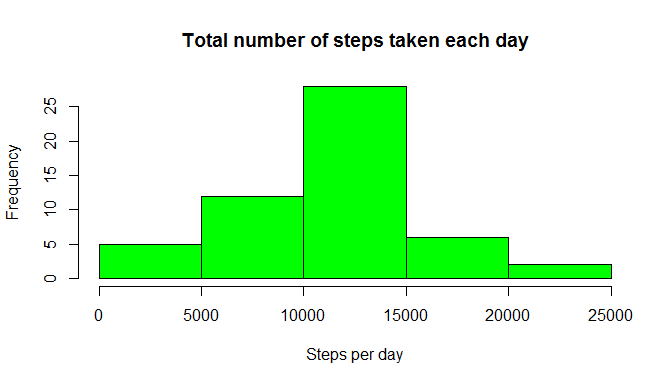
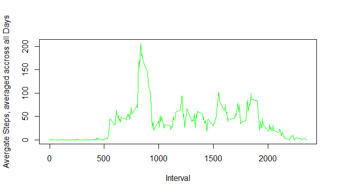
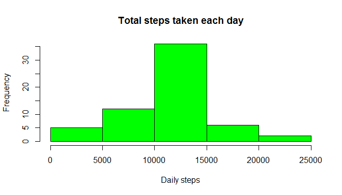
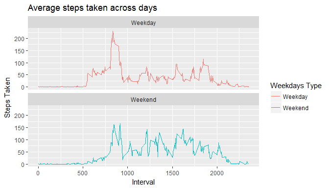

#Reproducible Research - Peer-graded Assignment: Course Project 1

--------------------------------------------------------------------

##Loading and preprocessing the data. 

The following code is needed to :

1. Load the data (i.e. read.csv()) 

2. Process/transform the data (if necessary) into a format suitable for analysis


```r
        library(dplyr)
        
        sourceFile <- "C:\\Users\\lguan\\Desktop\\work\\DS\\Course 5 - Reproducible Research\\week 2 - project\\repdata%2Fdata%2Factivity.zip"
        
        setwd("C:/Users/lguan/Desktop/work/DS/Course 5 - Reproducible Research/week 2 - project")
        
        unzip(sourceFile)
        
        sourceData <- read.csv("activity.csv", header=TRUE)
```

##What is mean total number of steps taken per day?

1. Calculate the total number of steps taken per day


```r
        StepsPerDay <- group_by(sourceData, date) %>% summarise(totalSteps=sum(steps))
```

2. Make a histogram of the total number of steps taken each day


```r
        hist(StepsPerDay$totalSteps, col="green", main="Total number of steps taken each day", xlab="Steps per day")
```

<!-- -->

3. Calculate and report the mean and median of the total number of steps taken per day


```r
        meanSteps <- mean(StepsPerDay$totalSteps, na.rm=TRUE)

        medianSteps <- median(StepsPerDay$totalSteps, na.rm=TRUE)
        
        meanSteps
```

```
## [1] 10766.19
```

```r
        medianSteps
```

```
## [1] 10765
```

##What is the average daily activity pattern?

1. Make a time series plot (i.e. type = "l") of the 5-minute interval (x-axis) and the average number of steps taken, averaged across all days (y-axis)


```r
        sourceData_N <- sourceData[complete.cases(sourceData),]

        avgSteps <- aggregate(steps ~ interval, FUN=mean, data=sourceData_N)
        
        plot(avgSteps, type = "l", xlab = "Interval", ylab = "Avergate Steps, averaged accross all Days", col = "green")
```

<!-- -->

2. Which 5-minute interval, on average across all the days in the dataset, contains the maximum number of steps?


```r
        tail(avgSteps[order(avgSteps$steps),],1)
```

```
##     interval    steps
## 104      835 206.1698
```

##Imputing missing values

Note that there are a number of days/intervals where there are missing values (coded as NA). The presence of missing days may introduce bias into some calculations or summaries of the data.

1. Calculate and report the total number of missing values in the dataset (i.e. the total number of rows with NAs)


```r
        print(nrow(sourceData[!complete.cases(sourceData),]))
```

```
## [1] 2304
```

2. Devise a strategy for filling in all of the missing values in the dataset. The strategy does not need to be sophisticated. For example, you could use the mean/median for that day, or the mean for that 5-minute interval, etc.

   I used the mean for that interval to populate missing values

3. Create a new dataset that is equal to the original dataset but with the missing data filled in.


```r
        dataComp <- sourceData

        for (i in 1:nrow(dataComp)) {
                if (is.na(dataComp$steps[i])){
                        dataComp$steps[i] <- mean(dataComp$steps[dataComp$interval==dataComp$interval[i]],na.rm=TRUE)
                }
        }
```

4. Make a histogram of the total number of steps taken each day and Calculate and report the mean and median total number of steps taken per day. Do these values differ from the estimates from the first part of the assignment? What is the impact of imputing missing data on the estimates of the total daily number of steps?


```r
        dailySteps <- aggregate(steps~date, dataComp, sum)

        hist(dailySteps$steps, col="green", main="Total steps taken each day",xlab="Daily steps")
```

<!-- -->

```r
        mean(dailySteps$steps)
```

```
## [1] 10766.19
```

```r
        median(dailySteps$steps)
```

```
## [1] 10766.19
```

   The mean value remains the same, and median value is slightly increased. 

##Are there differences in activity patterns between weekdays and weekends?

1. Create a new factor variable in the dataset with two levels - "weekday" and "weekend" indicating whether a given date is a weekday or weekend day.


```r
        dataW <- dataComp

        dataW$Date <- as.Date(dataComp$date)

        dataW <- select(dataW, steps, Date, interval)

        dataW$Day <- weekdays(dataW$Date)

        for (i in 1:nrow(dataW)) {
                if (dataW$Day[i] %in% c("Saturday", "Sunday")) {
                        dataW$weekdays[i] <- "Weekend"
                }
                else {
                        dataW$weekdays[i] <- "Weekday"
                }
        }

        dataW$weekdays <- as.factor(dataW$weekdays)
```

2. Make a panel plot containing a time series plot (i.e. type = "l") of the 5-minute interval (x-axis) and the average number of steps taken, averaged across all weekday days or weekend days (y-axis). 


```r
        library(ggplot2)

        avgStepsDay <- aggregate(steps ~ interval+weekdays, FUN=mean, data=dataW)

        gD <- ggplot(avgStepsDay, aes(interval, steps))

        gD + geom_line(aes(color=avgStepsDay$weekdays))+facet_wrap(~avgStepsDay$weekdays, ncol=1)+ labs(y="Steps Taken",x="Interval") + ggtitle("Average steps taken across days") + scale_colour_discrete(name="Weekdays Type", label=c("Weekday","Weekend"))
```

<!-- -->

